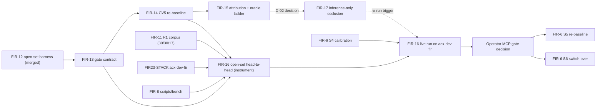

# FIR Open-Set Gate & Occlusion-Robust Recognition Roadmap (v1)

> **Date**: 2026-09-11
> **Author**: Claude Fable 5.1 (claude-fable-5-1) via sonnet drafting agent
> **Status**: draft
> **Owning epic**: [E22 Commercial Face Identity Replacement](../epics/v0.5.0/commercial-face-identity-replacement-epic.md) (Epic Short ID FIR)
> **Canon**: rule IDs cite [darce/heuristics-canon](https://github.com/darce/heuristics-canon); never pasted, always linked.

## Objective

Give FIR a measurable, gameable-resistant open-set identification gate (FNIR at a ratified FPIR, FPI as an integer count) and an inference-only path to close the occlusion gap the withdrawn pre-CVUP-1 numbers could not credibly show — without spending GPU hours or retraining before an operator-recorded D-01 decision says to.

## Problem Statement

FIR-12's open-set harness and FIR-5's face bake-off are merged (`d567a341c`, `fa3341409`, `c10eac1d8`) but unused: no bake-off has run, no gate contract exists, and the only occlusion numbers on record (M-12 0.865/0.321, recall 0.504, 2.73 faces/image) came from a pre-CVUP-1 (OpenCV 4.x) toolchain and are **withdrawn** — cited only as withdrawn, never as evidence. "Embedder leads detector" is an unattributed hypothesis. Without a written gate contract, a union-adjudication rule, and an alignment-vs-embedder attribution split, any occlusion fix risks being built on the wrong layer (detector vs aligner vs embedder) and evaluated against a threshold nobody ratified.

## Constraints

- No A10 (GPU) spend and no SCRFD/AdaFace retrain before an operator D-01 decision, reached only via T-09 → T-14 → D-01.
- Occlusion work is inference-only until D-01 says otherwise; FIR-7 Slices 2–4 (training) stay frozen behind `TRAINING_DECISION`.
- Corpus is locked at Golden-150 as remediated by FIR-11 R1 (30 entries / 30 probes / 17 identities usable for the paired non-inferiority check); this roadmap consumes FIR-11, never restates its corpus plan.
- `acx-dev-fir` (FIR23-STACK) must exist before any head-to-head; the head-to-head runs both stacks over public APIs, never a shared threshold across embedding spaces.
- VLM-6 (caption bake-off) is a separate program; the only coupling is the shared eval-manifest schema.
- Operator ratifies the fixed FPIR operating point; no plan may hard-code one.

## Terminology

- **FNIR@FPIR**: the open-set headline metric — defined once in the [epic terminology](../epics/v0.5.0/commercial-face-identity-replacement-epic.md) against NIST FRTE 1:N; measured with non-mated probes on an open-set gallery, score threshold swept.
- **FPI**: defined once in the [epic terminology](../epics/v0.5.0/commercial-face-identity-replacement-epic.md#terminology).
- **DIAGNOSTIC / DIRECTIONAL / REPORTABLE**: evidence tiers — DIAGNOSTIC = instrument-only or under-remediated corpus; DIRECTIONAL = under-powered but suggestive; REPORTABLE = powered, ratified-gate evidence.
- **Golden-150**: the FIR-11 R1 remediated corpus (150 − 7 − 3 → 30 entries / 30 probes / 17 identities, Product A/B split).
- **acx-dev-fir**: the FIR23-STACK environment (`ACX_ENV=dev-fir`, DB `alt_context_dev_fir` @ `PGVECTOR_DIM=128`) where the head-to-head runs.
- **pre-CVUP-1**: any artifact produced under the OpenCV 4.x toolchain, withdrawn wholesale.
- **T-01/T-09/T-14, D-01/D-02/D-03/D-08**: QA v8 task and decision IDs (`benchmarks/reports/fir-embeddings-dims-detectors-qa-20260723.html`, rev 2026-07-28). D-03's estimand, deferral behind T-02/T-04 and operator ownership are pinned in the [spec terminology](../specs/fir-open-set-gate-and-occlusion-spec.md#terminology). D-08 is the D3 open-set gate metric adoption decision (QA v8 rows 245/250) — the two are never aliased.

## Current State

- FIR-12's open-set harness (`scripts/eval_harness/open_set_identification.py`) and FIR-5's face bake-off (`scripts/eval_harness/fir_bakeoff_run.py`, `synthetic_occlusion.py`, `face_bakeoff.py`, `buffalo_bench.py`) are merged to `main` but have never been run end to end — FIR-12 is "the instrument, not a result."
- FIR-8's cross-stack bench package (`apps/prototype-description-service/scripts/bench/`, 34 modules) exists on `main` with 56/59 checklist items done and scores detection/identification P/R under CONFIRMATORY/DIRECTIONAL/DIAGNOSTIC tiers — but has **no open-set FNIR@FPIR leg**, and its live E2E is blocked on FIR23-STACK.
- FIR23-STACK's task plan is written (rev 2) but Slices 1–3 are unmerged and the stack has never been stood up.
- FIR-11 rev 7 owns corpus remediation; R1 delivers the 30/30/17 usable set this roadmap treats as a fixed input.
- FIR-6 (calibration) has S1/S3a merged, S2/S3b dark, S4/S5 corpus-gated, S6 (switch-over) operator-gated.
- FIR-7 (occlusion training adapters) has 0 of 43 checklist items done and its training slices are frozen behind `TRAINING_DECISION`; this roadmap's Phase C/D work is deliberately scoped to the inference-only slices FIR-7 cannot touch yet.
- No gate contract, no union-adjudication rule, and no alignment-vs-embedder attribution exist anywhere in the tree today. `face_metrics.py`'s `face_identification_pr` is pooled precision/recall with no alignment-intervention capability — the T-01 split has no anchor to build on.
- The only occlusion-relevant production knob today is `oact_coefficient` (`recognition/application/settings/clustering.py:66-70`, default `0.0`), and its current sign **lowers** the accept threshold as occlusion severity rises (verified via `ConfidenceCheck.evaluate`, `recognition/application/assignment/checks/confidence.py:91-242`) — the opposite of what an open-set criterion requires.

## Target Architecture

Two-stage face pipeline, unchanged at the detect/align/embed layer, gains one new inference-time stage and one new eval layer:

**Production path**: detect (YuNet) → align (`FivePointAligner`) → embed (SFace, 128D) → **visible-support match** (new: masked-cosine re-rank using a per-landmark visibility estimate, behind a dark knob) → confidence gate (`ConfidenceCheck.evaluate`, OACT-adjusted threshold).

**Eval harness composition** (all CPU, all offline, no production coupling until a stack is explicitly wired):
`open_set_identification.py` (FNIR/FPI primitives) → `fir_bakeoff_run.py` (`RunReport`, stratified probes) → new `gate_contract.py` (ratified operating point, rubric version) + new `union_adjudication.py` (T-14 kill/dead-zone/open verdict) → new `attribution_split.py` + `occlusion_ladder.py` (FIR-15's alignment-vs-embedder and oracle-vs-predicted splits) → FIR-8's `scripts/bench/` (cross-stack orchestration) extended with an open-set leg that calls back into `open_set_identification.py` and `gate_contract.py` for each stack under test.

### Design Decisions

| Decision | Rationale |
| --- | --- |
| D3 gate metric is FNIR@FPIR with FPIR named as a parameter, not hard-coded | Operator must ratify the operating point; a plan that bakes one in pre-empts that decision |
| No SCRFD/AdaFace retrain, no A10 spend before D-01 | T-09 → T-14 → D-01 is the cheapest kill path (20–34 person-h, $0); GPU spend before that gate is unjustified [PRINCIPLE #15] |
| Oracle-before-predicted occlusion ladder | Isolates "how much does perfect occlusion knowledge help" from "how good is our occlusion detector," so FIR-17's masking track (S1) can be parked at $0 if the oracle gap's CI includes 0 [EVAL-19] |
| Toolchain provenance stamped on every report row | Prevents re-litigating pre-CVUP-1-style contamination; `score-face` refuses cross-toolchain comparisons by default [DRIFT-03] |
| Own-tau per stack in the head-to-head | 128D SFace and 512D buffalo embeddings are not comparable at a shared threshold [EMB-01][IDX-02] |
| OACT sign flip (FIR-17 S0, occlusion term can only raise the threshold) | Under D3, rewarding occlusion with a lower threshold inflates FPIR; non-negativity of the coefficient is repurposed to mean "never relaxes" instead of "never tightens". Unconditional — lands before D-02 in every branch, so it is scheduled in Phase B, not Phase C |
| `masked_cosine` implemented once, imported by both eval and production | Prevents the eval harness and the production re-rank from silently diverging on the visible-support definition |

### Data Model

- **`GateContract`** (frozen dataclass, `gate_contract.py`, loaded from `benchmarks/manifests/fir-gate-contract-v1.json`): `metric="FNIR@FPIR"`, `max_fpi: int | None`, `n_nonmated_declared: int | None`, `rubric_version`, `ratified_by_decision_id: str | None`, `t14_thresholds_declared: dict[str, float] | None`, `t14_thresholds_sha256: str | None` — all seven keys required. Operating point and the T-14 threshold fields stay `null` until the operator ratifies it (rg-008 load-time validation; `GateContractError` on malformed/missing keys).
- **`RunReport.to_rows()`** (`fir_bakeoff_run.py:183-260`) gains one new column: the `rubric_version` (`face-label-rule/v1`) each row was adjudicated under, plus a `toolchain` block (`{opencv, onnxruntime, numeric_runtime_fingerprint}`) on every face report.
- **`attribution.json`** (FIR-15 output, `benchmarks/results/attribution-t01-<date>/`): `{alignment_share, buffalo_reference_gap, ci: {alignment, buffalo_reference}, reference_fnir, n_units, tau_by_space: {sface128, buffalo512}, toolchain}` — no `embedder_share` and no single `tau` (DD-01/DD-11).
- **`benchmarks/results/WITHDRAWN.md`**: register of the five `golden150-fir-*-20260723/` result dirs + M-12 + recall 0.504 + 2.73 faces/image, each with a reason.
- **`sface-support-map-v1.json`** (`recognition/infrastructure/face_pipeline/assets/`): versioned, sha256-verified (same pattern as `provenance.py`'s `MODEL_MANIFEST`) landmark-region → embedding-dimension support map consumed by `masked_cosine`.
- **`MediaIdentity.match_score: float | None`** and **`MediaIdentity.match_cluster_id: str | None`** (FIR-16 S1a, `db/models/identity.py`, greenfield edit of `001_identity_schema.py`): the pre-gate best centroid match — captured in `CentroidDiscovery.discover` (`recognition/application/discovery/centroid.py:30-60`) before the `similarity_threshold` filter, not in `ConfidenceCheck` — persisted for every detected face regardless of the accept decision and exported by `_serialize_identity`; the only per-face score/cluster the open-set leg may consume [rg-015]. `_find_best_centroid_match` (62–87) initialises `best_similarity = -inf` / `best_cluster = None` and returns `(None, None)` for an empty gallery so negative best matches are preserved. Export path: `MediaIdentityService.list_by_media_ids` → `RemoteSceneClient.media_identities` → `scripts/bench/export_map.py` rows gain both fields; `top1_name` for the gate metric is the enrollment-gallery name of `match_cluster_id` (GT-derived optimistic labels are prohibited for the gate metric).
- **`benchmarks/results/crossbench-<stamp>/open_set.json` / `.md`**: FIR-16's per-stack `{fnir_at_gate, tau, fpi, n_mated, n_nonmated, coverage_gaps, toolchain, contract}` plus the paired non-inferiority result.

### Task Dependency Diagram

## Phased Delivery

| Phase | Tasks | Entry Gate | Exit Evidence | Cost |
| --- | --- | --- | --- | --- |
| A — Contract + re-baseline | FIR-13, FIR-14 | FIR-12 merged | `gate_contract.py` + `union_adjudication.py` merged with tests green; `benchmarks/protocols/face-label-rule.md` + `t14-dead-zone-rule.md` written; `benchmarks/results/WITHDRAWN.md` published; CV5 re-baseline (both legs) run and scored, DIAGNOSTIC tier, toolchain block attached; face determinism anchor passes on CV5 | CPU, $0 |
| B — Attribution | FIR-15, FIR-17 S0 | Phase A done | `attribution.json` + `REPORT.md` naming the leg (alignment / embedder / both / inconclusive) with bootstrap intervals; oracle-vs-predicted occlusion-ladder result with CI on the oracle gap; D-02 decision recorded in MCP; FIR-17 S0 (OACT sign fix) merged — unconditional, lands before D-02 in every branch, default `0.0` unchanged, with `TestOactDarkScaffold` + `test_confidence_check.py` + `test_face_quality_factors.py` leniency assertions updated | CPU, $0 (+ operator labour: reference landmarks / hand-drawn masks, ≤30 probes) |
| C — Inference-only occlusion + instrument | FIR-17 S1/S2/S3 (branch-gated on D-02), FIR-16 S1–S3 | FIR-15's D-02 decision (FIR-17 branch rule); FIR-13 contract + FIR-14 toolchain + FIR-8 `scripts/bench` existing (FIR-16 instrument) | FIR-17 `visible_support_matching` knob merged dark, default `False`, behaviour-neutral (EMBEDDER branch, S1); pose-head rescue is ADR-only (S2) — ADR + follow-up task, no knob, no runtime code; DETECTOR/INCONCLUSIVE branches close with a docs-only handoff (S3); FIR-16 `score_open_set` / `score_report` `open_set` section / `propose-gate` CLI merged with mocked-export tests green — no live run yet | CPU, $0 |
| D — Head-to-head + gate flip | FIR-16 S4, FIR-6 S4/S5/S6 | acx-dev-fir stood up (FIR23-STACK); FIR-11 R1 remediated manifest; FIR-6 S4 calibration (with FIR-17's OACT fix) done | `open_set.json`/`.md` report with FNIR@FPIR per stack at its own swept tau, `paired_ni_score_test` non-inferiority result, `propose-gate` proposal block, operator `fir_gate_decision_<date>` MCP decision; FIR-6 S6 switch-over executed citing that decision; `bench` extra install removed from the production Dockerfile stage (the `bench` extra itself stays in `pyproject.toml` for evaluation) | A1 (ARM CPU) on acx-dev-fir, $0 GPU spend; requires FIR23-STACK |

## External Dependencies

| Dependency | Owner | Status | Blocks |
| --- | --- | --- | --- |
| FIR-11 R1 corpus remediation + operator labelling (~20–34 person-h for T-14; reference landmarks / hand-drawn masks for FIR-15, ≤30 probes) | Operator + FIR-11 | In progress (rev 7) | Phase B full attribution, Phase D head-to-head |
| FIR23-STACK stand-up (`acx-dev-fir`) | Infra | Slices 1–3 unmerged, stack never stood up | Phase D entry gate |
| OpenCV 5.0.0.93 toolchain pin (`pyproject.toml:43`) | Backend | Done (dependency pinned) | Phase A re-baseline validity |
| `insightface` `[bench]` extra licence isolation | Backend | NOT yet isolated: today's production Dockerfile installs the `bench` extra (with InsightFace) into the production image (`apps/prototype-description-service/Dockerfile` ~70–80); eval-only isolation is a POST-cutover requirement — success is removing the `bench` install from the production stage, keeping the `bench` extra in `pyproject.toml` for evaluation | FIR-16 buffalo leg, FIR-15 arm (d) |
| FIR-8 `scripts/bench/` cross-stack orchestration | Backend | 56/59 done, no open-set leg | FIR-16 S1–S3 |
| FIR-6 S4 calibration on remediated corpus (consumes FIR-17's OACT fix) | Backend | Corpus-gated | Phase D entry gate |

## Code Anchors

| Layer | File | Note |
| --- | --- | --- |
| Eval — open-set primitives | `apps/prototype-description-service/scripts/eval_harness/open_set_identification.py` | `IETPoint`, `fnir_fpi_at_threshold`, `iet_curve` — FIR-13/FIR-16 build on this, unmodified |
| Eval — bake-off run | `apps/prototype-description-service/scripts/eval_harness/fir_bakeoff_run.py` | `RunReport.to_rows()` gains `rubric_version` column (FIR-13 S1); `score_run` consumed by FIR-16 S1 |
| Eval — new gate contract | `apps/prototype-description-service/scripts/eval_harness/gate_contract.py` | NEW (FIR-13 S2) |
| Eval — new union adjudication | `apps/prototype-description-service/scripts/eval_harness/union_adjudication.py` | NEW (FIR-13 S3) — T-14 kill/dead-zone/open verdict |
| Eval — new attribution split | `apps/prototype-description-service/scripts/eval_harness/attribution_split.py` | NEW (FIR-15 S1) |
| Eval — new occlusion ladder | `apps/prototype-description-service/scripts/eval_harness/occlusion_ladder.py` | NEW (FIR-15 S2) — hosts `masked_cosine` until moved to a shared module (FIR-17 S4) |
| Eval — synthetic occlusion twins | `apps/prototype-description-service/scripts/eval_harness/synthetic_occlusion.py` | `generate_twin_specs`, `anatomy_region_stats`, `WALK_STABILITY_DELTA_BOUND=0.05` — FIR-15 rung 1 oracle masks |
| Eval — buffalo reference leg | `apps/prototype-description-service/scripts/eval_harness/buffalo_bench.py` | `BuffaloFusedLeg`, gated by `ACX_EVAL_BENCH=1` — FIR-15 arm (c)/(d), FIR-16 buffalo leg |
| Eval — calibration CLI | `apps/prototype-description-service/scripts/eval_harness/calibrate_face_thresholds.py` | `--oact-coefficient` flag semantics documented as "stricter-with-occlusion" (FIR-17 S0) |
| Cross-stack bench | `apps/prototype-description-service/scripts/bench/` | 34-module package (`score.py`, `score_report.py`, `cross_stack_bench.py`, ...); FIR-16 S1–S3 extend it with an `open_set` leg — inner function anchors not yet codemap-verified |
| Production — quality/OACT | `apps/prototype-description-service/recognition/application/assignment/quality.py` | `compute_quality_adjustment` line 136 `oact_term` — sign flip target (FIR-17 S0) |
| Production — confidence gate | `apps/prototype-description-service/recognition/application/assignment/checks/confidence.py` | `ConfidenceCheck.evaluate` (91–242) — verified: positive `oact_coefficient` currently lowers the accept threshold under occlusion |
| Production — face pipeline settings | `apps/prototype-description-service/recognition/config/settings.py` | `FacePipelineSettings.oact_coefficient` (377–384); new `visible_support_matching` field lands here (FIR-17 S1). No `pose_head_rescue` settings field — pose-head rescue is ADR-only (FIR-17 S2), no runtime code |
| Production — face quality factors | `apps/prototype-description-service/recognition/infrastructure/embeddings/face_quality_factors.py` | `compute_occlusion_severity` (line ~82) extended to `estimate_region_visibility` (FIR-17 S1); no `face_pipeline/` or `application/scan/` copy exists |
| Production — model provenance | `apps/prototype-description-service/recognition/infrastructure/face_pipeline/provenance.py` | `MODEL_MANIFEST`, `load_verified_model` — pattern reused for the new support-map asset |

## Risks and Mitigations

- **Risk**: T-14's union-adjudication bound comes in under 0.05 and the detector line closes.
  Mitigation: this is a valid, cheap outcome — FIR-15/FIR-17 detector-side arms simply drop; the four mandatory T-14 conditions (union defined on human-verified faces, matched-FPPI operating points, bootstrap UCL not point estimate, thresholds declared before the run) guard against a gamed result either direction.
- **Risk**: the oracle-vs-predicted occlusion gap's 95% CI includes 0.
  Mitigation: FIR-15 records this as an explicit exit; FIR-17's branch rule collapses to INCONCLUSIVE (S0 OACT sign fix, already landed in Phase B, plus S2 pose-rescue ADR and S3 docs-only handoff — no new production code), so no adapter-track GPU or engineering spend follows a null result.
- **Risk**: FIR-11 R1 operator labelling slips past this roadmap's timeline.
  Mitigation: Phases A–C are corpus-remediation-independent for scaffolding and DIAGNOSTIC measurement (CPU $0) — but anything ADMISSIBLE (FIR-6 S4 calibration inside Phase C, the D-02/D3 ratification) still waits for FIR-11 R1; only that admissible-evidence subset is blocked, not the scaffolding.
- **Risk**: toolchain drift (OpenCV version bump) silently invalidates a re-baseline comparison.
  Mitigation: FIR-14's toolchain block + `score-face --allow-toolchain-drift` guard refuses a cross-toolchain compare by default.
- **Risk**: `U` (the union-adjudication denominator) is partly controlled by the systems under test, inviting a gamed union.
  Mitigation: T-14 condition (iv) — both thresholds declared before the run and never revised afterward.
- **Risk**: FIR23-STACK stays unmerged and Phase D never gets an entry gate.
  Mitigation: Phase C ships FIR-16's instrument against mocked exports regardless, so the live-run slice is the only one stalled.
- **Risk**: the OACT sign flip (FIR-17 S0) regresses production behaviour.
  Mitigation: default stays `0.0` (dark) so the flip is behaviour-neutral until FIR-6 S4 sets a nonzero value on the remediated corpus; the same slice updates `TestOactDarkScaffold`, `test_confidence_check.py`, and the leniency assertions in `test_face_quality_factors.py`.
- **Risk**: the head-to-head is under-powered per FIR-11's power ceiling.
  Mitigation: `propose-gate` surfaces `coverage_gaps` and tiers the report DIRECTIONAL at best; the operator decision must name the tier, never silently upgrade it.

## Success Metrics

- FNIR measured at the operator-ratified FPIR on the FIR-11 R1 corpus (30 probes / 17 identities), open-set, non-mated probes, FPI reported as an integer count, never a rate.
- Every share/gap claim (T-01 alignment/embedder split, oracle-vs-predicted gap, T-14 bound) reported with a bootstrap interval (B=2000, `resampling_unit="image"`).
- Head-to-head evidence tier (DIAGNOSTIC / DIRECTIONAL / REPORTABLE) named explicitly per FIR-11's power ceiling; never silently upgraded.
- FIR-16's non-inferiority test uses FIR-11's `paired_ni_score_test` (Nam/Tango score construction, one-sided α = 0.025) unchanged.
- `face_pipeline` (128D) and `buffalo_l` (512D) are never compared at a shared swept threshold.
- Zero training runs and zero A10 spend recorded before an operator D-01 decision exists.

---

# Consolidated Checklist

## Phase A: Contract + re-baseline

- [ ] FIR-13 S1: `benchmarks/protocols/face-label-rule.md` written; `RUBRIC_VERSION` constant added to `gate_contract.py` and stamped into `RunReport.to_rows()`.
- [ ] FIR-13 S2: `gate_contract.py` (`GateContract`, `select_gate_point`, `GateSummary`) merged, loaded from `benchmarks/manifests/fir-gate-contract-v1.json` with load-time validation.
- [ ] FIR-13 S3: `union_adjudication.py` (`detector_gap_bound`, `bootstrap_ucl`, `miss_inflate`, `DeadZoneVerdict`) merged; `benchmarks/protocols/t14-dead-zone-rule.md` template written.
- [ ] FIR-14 S1: `benchmarks/results/WITHDRAWN.md` published; toolchain block added to face reports; `score-face --allow-toolchain-drift` guard added.
- [ ] FIR-14 S2: CV5 re-baseline run (both legs) scored to `benchmarks/results/golden150-cv5-rebaseline-<date>/`, DIAGNOSTIC tier, determinism-checked.
- [ ] FIR-14 S3: toolchain arm JSON emitted for FIR-11 S5 consumption.
- [ ] FIR-14 S4: face determinism anchor verified (or regenerated) on CV5.

## Phase B: Attribution

- [ ] FIR-15 S1: `attribution_split.py` four-arm split implemented; `attribution.json` produced with shares + CIs.
- [ ] FIR-15 S2: `occlusion_ladder.py` (oracle-before-predicted rungs, `masked_cosine`) implemented; oracle gap + CI computed.
- [ ] FIR-15 S3: `REPORT.md` written naming the leg; D-02 decision (`firplan_d02_attribution_<date>`) recorded in MCP.
- [ ] FIR-17 S0: OACT sign fix merged in `compute_quality_adjustment` (unconditional, before D-02 in every branch; default `0.0` unchanged; `test_face_quality_factors.py` leniency assertions retightened).

## Phase C: Inference-only occlusion + instrument

- [ ] FIR-17 S1 (EMBEDDER branch): `visible_support_matching` knob + `estimate_region_visibility` + support-map asset merged dark.
- [ ] FIR-17 S2 (INCONCLUSIVE branch): pose-head rescue — ADR + named follow-up task only; no settings knob, no runtime code, no stratum tests in FIR-17.
- [ ] FIR-17 S3 (DETECTOR and INCONCLUSIVE branches): docs-only handoff — no runtime code.
- [ ] FIR-17 S4 (EMBEDDER branch): `masked_cosine` single-definition + import-isolation test confirmed in `recognition/infrastructure/embeddings/masked_similarity.py`.
- [ ] FIR-16 S1: `scripts/bench/score.py` open-set leg (`score_open_set`) merged with mocked-export tests.
- [ ] FIR-16 S2: `score_report.py` `open_set` section + paired non-inferiority test merged.
- [ ] FIR-16 S3: `propose-gate` CLI merged; `fir_gate_decision_<date>` decision template validated (no live run yet).

## Phase D: Head-to-head + gate flip

- [ ] FIR-16 S4: live run on acx-dev-fir executed; report published.
- [ ] FIR-6 S4/S5: calibration + re-baseline on remediated corpus with FIR-17's OACT fix.
- [ ] Operator MCP gate decision recorded.
- [ ] FIR-6 S6: switch-over executed citing the gate decision; `bench` extra removed from the production Dockerfile install (extra stays in `pyproject.toml` for evaluation).

## Deferred (Post-v1)

- [ ] Head/torso secondary recognition channel (C4) — not-doing until a future wave.
- [ ] Any SCRFD/AdaFace retrain or training-slice work in FIR-7 — frozen behind `TRAINING_DECISION` / D-01.
- [ ] Multi-OS / non-Mac packaging of any worker touching this pipeline — out of scope for this roadmap.

## Success Criteria

- [ ] A ratified `GateContract` operating point exists and every published open-set report cites it.
- [ ] FIR-16's head-to-head report shows FNIR@FPIR for both stacks, own-tau, with an explicit evidence tier and a recorded operator gate decision.
- [ ] FIR-6 S6 switch-over is complete and the `bench` install is removed from the production Dockerfile stage (the `bench` extra remains in `pyproject.toml` for evaluation).
- [ ] No withdrawn number appears anywhere as evidence in a merged report.
