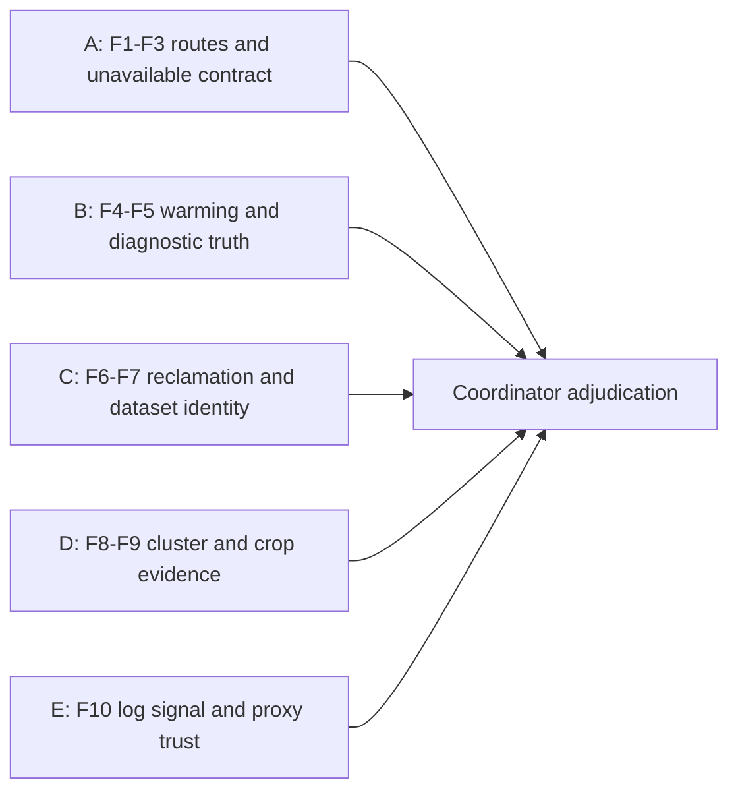
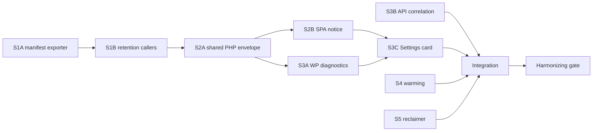

# DEMOHEAL parallel delivery and adjudication

Date: 2026-09-21. Baseline `11fe4dea7`. This packet accompanies the [task plan](../tasks/v0.5.0/DEMOHEAL-1-truthful-service-state-and-reclaimer-liveness-task-plan.md), [epic](../epics/v0.5.0/demo-operability-and-mirror-self-healing-epic.md) and [contract draft](demoheal-operability-contract-draft.md). The [JSON graph](demoheal-dependency-dag.json) is planning data, not an executable worker manifest.

## Graph interpretation

This is a **dependency graph**, not a runtime retry/state-transition graph (GRPH-01/02). Edges name consumed outputs (GRPH-32); file collisions are separate resource edges (GRPH-09), never an excuse to order unrelated tasks. Under a finite worker cap, prioritize ready nodes by remaining critical-path length (GRPH-31), filling spare slots with independent work. Durations are not measured; a seven-unit chain is a unit-weight lower bound, not a wall-clock estimate or optimal schedule claim.

WorkBay `lane_dag(task_ref="DEMOHEAL-1")` successfully analyzed the planned nodes on 2026-09-21: 18 nodes including five defect-review groups, their adjudicator and the attempted remote review lane; layer widths `10,2,1,2,1,1,1`; no cycle. It separately identified the two shared PHP-file resource edges. Its label “admitted width 10” describes that graph result, **not ten provisioned workers**. The implementation subgraph has four initial ready nodes. Python `graphlib.TopologicalSorter` independently checked the JSON task graph. No remote adjudication result is implied by graph admission.

## Defect adjudication DAG

These five read-only groups share the frozen packet; they do not write the same planning documents. No group waits for another's verdict. F8/F9 report missing evidence and trace targets rather than invent a serializer or clustering fix. Adjudication merges duplicate proposals and decides against the actual code/source; it is not majority voting.

| Group | Required exact anchors / evidence | Decision questions |
| --- | --- | --- |
| A | RetentionController, GpuControlController, serviceUnavailable parser; actual emitted API paths | Does the manifest cover callers? Are route 404 and entity 404 distinct? Does thrown-error rendering preserve truth? |
| B | GpuStatusResponse/GpuStateResponse, useDescribeRunProgress/useActivityStatus, proxy_request, existing correlation middleware | Which evidence supports warming? Can waiting renew forever? Can local rejection be misrepresented as an API attempt? |
| C | OutboxMaintenanceService purge result/eligibility; OutboxDrain callers; snapshot/reset contracts | Does success mean committed work? Are locks atomic? Can restore reuse identity or expose a mixed/partial mirror? |
| D | Operator observation only until exact producer trace; detector→persistence→snapshot→representative | Does bbox_area prove a serializable box? Are merge suggestions pairwise verified and human-confirmed? |
| E | dependency timing logger, API logging configuration, trusted-proxy config | Are action-worthy errors retained? Can untrusted clients spoof forwarding headers? Does access logging carry the received request id? |

## DEMOHEAL-1 task DAG

| Edge | Consumed output / constraint |
| --- | --- |
| S1A→S1B | Sorted method/path fixture consumed by emitted-route parity test |
| S1B→S2A | Route metadata classifies route-level vs entity-not-found |
| S2A→S2B | Reason/envelope producer fixture consumed by TS parser/notice |
| S2A→S3A | Shared envelope builder and vocabulary for diagnostic failures |
| S2B→S3C | Shared notice component |
| S3A→S3C | Diagnostic/check/reset response fixtures |
| S3B/S3C/S4/S5→INTEGRATE | Verified changed behavior, test receipts, registration and cleanup additions |
| INTEGRATE→GATE | Combined diff and re-run boundary proofs |

Initial ready set is `{S1A,S3B,S4,S5}`; S2B and S3A form another antichain. Start with S1A as critical-path priority and fill available slots from the other ready nodes. S4 and S5 consume **nothing** from S3; there is no S3→S4 or S3→S5 edge. Tests/design may be prepared before an implementation prerequisite lands, using the frozen input contract.

Shared-file conflicts: S1B/S2A own successive versions of RetentionController; S2A/S3A own successive versions of the abstract proxy. Their data edges already order integration. `SettingsPage`, endpoint localization, manual includes, `uninstall.php` and combined UX-map output belong to INTEGRATE, with lane-provided additions; do not let independent workers overwrite them. Ownership seeds in JSON are not exhaustive dispatch allowlists: include all tests/fixtures and verified frontend/registration paths from the task plan when materializing actual lanes.

## Epic task DAG

DEMOHEAL-1 implementation, DEMOHEAL-2 contract/destructive-entrypoint inventory, DEMOHEAL-3 F8/F9 root-cause traces and DEMOHEAL-4 log-noise work are independent ready groups. Phase labels do not impose a serial chain. DEMOHEAL-4's final correlation proof consumes DEMOHEAL-1's request-id contract. API logging/main-file edits have one integrator; their investigation and tests remain parallel. DEMOHEAL-2's API and mirror implementations can run in parallel after their own contract is frozen, with a join for reset/restore/race drills. Its ungrounded destructive-entrypoint inventory prevents claiming that later task implementation-ready now.

## Every review lane receives this packet

1. Frozen four planning docs plus contract draft, JSON DAG, production baseline and path:symbol anchors; no dependence on the coordinator's conversation window (GRPH-33).
2. Semantic retrieval: VLM-2B finding 2148 and VLM-6 finding 9234 (breaker liveness/warmup); E15-35 decision 2514 (per-row CAS). `gte-base-en-v1.5` retrieval was verified; semantic reinjection selected drafting decision 13168. Fetch full prior rows when needed; similarity alone is not correctness (GRPH-36).
3. GPUFLOW-3 continuation `cont-20260919T232614799720Z-d1c8fec2`, superseding its named predecessor: previous gate is complete, do not repeat it. Requested `cont-20260921T013420893070Z-76a5e843` was not found in the connected MCP; its content and decision 13055/blocker 806 linkage remain unverified.
4. Read-only corpus paths under `~/Development/heuristics-canon-research`: `distilled/engineering/{release-it,designing-data-intensive-applications,latency-reduce-delay-in-software-systems,patterns-of-distributed-systems,observability-engineering}.md`, `lexicons/{engineering,graph-theory,interaction-ux,security}.md`, `reasoning/`, `PRINCIPLES.md`. Link [heuristics canon](https://github.com/darce/heuristics-canon), cite stable rule IDs at use time. If a remote environment lacks these sources, disclose that limitation; do not fabricate source validation.
5. Bounded output contract: `{group, baseline, examined_anchors:[{path,symbol}], proposals:[{severity,claim,evidence,rule_ids,counter_case,proposed_change}], unverified:[]}`. Findings are proposals until coordinator adjudication. No production edits or merge. Mechanical classification uses the requested `codex-remote / gpt-5.6-luna / max`; no fallback without an explicit new routing decision.

The attempted remote review carried code anchors, prior-art hits and semantic reinjection context; it failed at capability attestation before serving a model (`transport_missing`, MCP blocker 812). Transport was restored and blocker 812 resolved on 2026-09-21 (decision 13176). The next-wave classification lane actually served codex-remote Luna/MAX and returned a useful report, but its overall pass timed out before review completion; it does not satisfy the original independent planning-review coverage gate. Follow the [current next-wave packet](next-wave-gpu-ui-fir512-dag.md) rather than retrying a stale snapshot.
