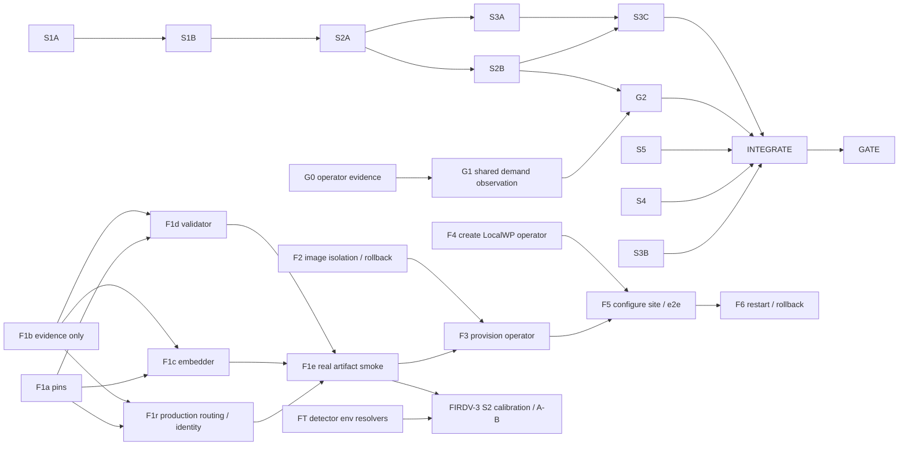

# Next wave: GPU demo, UI truth, LocalWP 512D FIR — ranked work and lane DAG

Date: 2026-09-21. Baseline `11fe4dea7`. Planning data, not a dispatch manifest. Excluded by operator decision: WorkBay fixes (MCP tool echo defect, semantic reinjection). Companions: [DEMOHEAL-1 task plan](../tasks/v0.5.0/DEMOHEAL-1-truthful-service-state-and-reclaimer-liveness-task-plan.md), [parallel delivery](demoheal-parallel-delivery.md), [FIR 512D roadmap](../roadmaps/fir-localwp-512d-implementation-roadmap-2026-09-19.md).

## What the code says (codemap-verified)

GPU start is demand-driven, not intent-driven. `describe_run.create_describe_run` and `describe_run_worker.run_describe_job` call `publish_demand_snapshot`, which writes the load-snapshot file; the host reaper (`infra/oci/gpu_lifecycle/reaper.py:_run_start_cycle` → `_start_work_decision` → `_actuate_start_instances`) starts the instance when `load.has_work`. `POST /scene/gpu/intent` is the operator override only, so zero intent POSTs during a describe run is expected, not a defect. Handoff finding `DEMO-UX-1-GPU-01` (open, 2026-08-22, "controller only emits STOP") predates that START path and needs re-verification then disposition.

Nearly wired, not yet truthful: `publish_demand_snapshot` swallows every failure at `logger.debug` (`describe_run_worker.py:420`). An unwritable or mis-mounted load path yields a run that reports `warming` while the reaper never sees demand (RLSE-05). `_start_work_decision` likewise refuses START on an untrustworthy snapshot and only logs. Neither reaches `GpuStatusResponse`. The backend does bound the wait (`_fail_run_on_gpu_warmup_timeout`, `gpu_warmup_timeout_seconds`); the SPA does not (DEMOHEAL-1 slice 4).

FIR: DB and settings are dimension-parameterized from `PGVECTOR_DIM` (`db/settings.py:216`, default 512; `001_identity_schema.py` uses `EMBEDDING_DIMENSION`). 128D is pinned only in `.env.fir.example:89`, `apps/prototype-description-service/scripts/validate_fir_dev_runtime.py:EXPECTED_MODEL_CONTRACT` (`EXPECTED_MODEL_CONTRACT`) and the `sface` provenance entry. The `auraface` 512D entry exists (`provenance.py:124-132`) with `sha256`/`license_sha256` still = `PENDING_OPERATOR_FETCH` on main; `health.py:check_model_space` correctly fails `/ready` closed. Merged: FIRDV-1 S1, FIRDV-2 S1/S3a, FIRDV-3 S1a/S1b. Not started: FIRDV-1 S2–S5, FIRDV-3 S2/S6. No LocalWP site, FIR service or FIR database exists. `dev` and `dev-fir` share the `:dev` image tag, so `make deploy-rollback-dev-fir` refuses (`mk/deploy.mk:162`).

## Ranked work

| Rank | Node | Work | Why first | Canon |
| --- | --- | --- | --- | --- |
| 1 | G0 | Operator read: load-snapshot path inside `acx-prod-api-1`, reaper unit journal, `GET /scene/gpu/status` during a run | Every GPU mechanism claim is a guess until observed | DBG-02 |
| 2 | G1 | Demand-publish failure becomes a WARNING with reason and surfaces as a `GpuStatusResponse` field | Removes the silent path behind "Warming forever" | RLSE-05, OBS-05 |
| 3 | S4 | Finite warming observation (`warmingDeadline.ts`) | SPA stops lying regardless of G0 outcome | INT-08, INT-10 |
| 4 | S1A→S1B | Route manifest + retention caller paths | One-line-class bug, panel dead on demo | API parity, rg-005 |
| 5 | S2A→S2B | One unavailable envelope + shared notice, reusing `serviceUnavailable.ts` | Parser and copy table already exist; producers diverge | RES-15, OBS-05 |
| 6 | S5 | Reclaimer liveness | Independent, ready | RES-07 |
| 7 | G2 | GPU card renders demand/start evidence from G1 | Consumes G1 field | INT-10 |
| 8 | F-chain | LocalWP 512D FIR instance on Apache-2.0 AuraFace (below) | Operator decision 2026-09-21: the `face_pipeline` embedder moves from SFace 128D to AuraFace 512D. Artifact fetched; the code path exists but is wired to the SFace embedder and cannot produce a vector | roadmap phases 2, 5, 6 |
| 9 | S3A/S3B/S3C | Diagnostics, correlation id, Settings card | Value after envelope lands | OBS-03, DATA-13 |

## LocalWP 512D FIR: correct stand-up order

512D cannot be reached by setting `PGVECTOR_DIM=512` while loading SFace; the vectors would be 128D and the fail-fast dimension assert refuses boot. The 512D route is AuraFace in its own model space, store and service.

1. **F0 (done, handoff decision 13072, 2026-09-21)**: AuraFace-v1 `glintr100.onnx` fetched to the OCI VM only, at `/opt/acx-backend/data/dev-models/face_pipeline/`; full-file sha256 matches the publisher value, size 260694151; `LICENSE.md` Apache-2.0 hashed. Measured: input `[N,3,112,112]` float32, output `[1,512]` float32, output **not** L2-normalized (FIR512-BR-01), so the adapter normalizes. The running `acx-dev` default is already insightface/buffalo_l at 512D: this route is a licensing migration off a non-commercial artifact. Vendor CFP-FP figures are not a measured comparison in this environment; quality remains experimental until controlled evaluation.
2. **F1 — make the AuraFace space actually embed.** Operator decision 2026-09-21: the FIR embedder changes from SFace 128D to the Apache-2.0 AuraFace 512D weights; YuNet detection and five-point alignment stay. `ModelSpace.AURAFACE` and `RECOGNITION_FACE_PIPELINE_PROFILE=auraface` already select the space, but additional defects sit behind the pending hash pin, so pinning alone would move the failure from `/ready` to the first scan:
   - `face_pipeline_adapter.py:_load_face_pipeline_runtime` builds `OrtSFaceEmbedder(model_name="auraface")`, and `OrtSFaceEmbedder.__init__` hard-sets `embedding_dim = SFACE_EMBEDDING_DIM` (128). `_common.embed_batch` then raises `expected embedding dim 128, got 512` on every crop.
   - `OrtSFaceEmbedder._feature` calls `_bgr_to_sface_blob`, which swaps channels and applies scale 1, mean 0. The AuraFace aligner already emits RGB (`FivePointAligner.channel_order`), so the swap hands the model BGR, and the manifest's declared `input_scale=1/127.5` is never applied.
   - `provenance.py` declares `output_l2_normalized=True`; measured False (FIR512-BR-01). `embed_batch` normalizes regardless, so this is a manifest-truth fix, not a behaviour fix.

   Split into bounded lanes; names below are planning identifiers, not provisioned workers:
   - **F1a pin** owns `face_pipeline/provenance.py` only: copy the verified artifact SHA256 `a7933ea5330113b01c9b60351d8f4c33003f145d8470ac5f0e52ee2effe25c60` and license SHA256 `609e2cb599f84aaa41d8ef29d8fdb04d164fab22e8d9292ca34a599d0f56a338` from decision 13072; set `license_file="LICENSE.md"` to match the measured mount and `output_l2_normalized=False`. Preserve preprocessing UNVERIFIED markers until F1b evidence exists. Test missing/wrong weights and license still fail closed.
   - **F1b measure** writes an evidence report only, never `provenance.py`. On the authorized VM artifact mount, inspect graph input/type/layout and initial operators, obtain the exact artifact's reference preprocessing, and compare numerical destination points with the ArcFace-112 template. Presence or absence of `Sub`/`Mul` alone does **not** establish required external mean/scale. Record the full formula, channel order, interpolation/alignment and sources; compare known pixel fixtures through reference and proposed blob transforms. If reference evidence is missing, leave the contract unverified and block F1c/F1d/F1r; do not guess. No downloads or production access are implied by this lane. Freeze the preprocessing/model identity packet after F1a+F1b.
   - **F1c embedder**, after F1a+F1b, owns `ort_adapters.py:OrtSFaceEmbedder`, `face_pipeline_adapter.py:_load_face_pipeline_runtime` and the final `provenance.py` preprocessing update. Add explicit mean/offset representation to `InputPreprocessing` (currently only scale exists), with defaults preserving SFace exactly; apply the measured affine transform/channel contract once. A named AuraFace adapter delegates dimension, finiteness and normalization validation to `_common.py:embed_batch`; do not duplicate it. RED first: synthetic 512-output inference via the AuraFace factory, known-pixel blob parity, SFace bit-exact 128D output/preprocessing, and rejection of a 512D SFace configuration. Keep SFace as the FIRDV-2 comparator; never fall back across spaces.
   - **F1r production routing/identity**, in parallel with F1c/F1d after F1a+F1b: `recognition/infrastructure/embeddings/runtime_factory.py:build_embedding_runtime` and `recognition/application/embedding/manifest.py:active_embedding_model_id` currently handle only `face_pipeline` and `insightface`; `auraface` raises `UnhandledModelSpaceError`. Add explicit AuraFace dispatch and exact manifest-derived active ID through existing APIs. Own these two files plus focused tests, never adapter/provenance files. Test production (non-stub) factory routing, missing-artifact failure, no InsightFace fallback, and active-ID agreement with runtime/persisted vectors. Preserve fail-closed filtering; the greenfield candidate may not use unstamped legacy rows. The low-level selectable space is not end-to-end factory support.
   - **F1d validator**, in parallel with F1c after the frozen F1a+F1b packet, owns `apps/prototype-description-service/scripts/validate_fir_dev_runtime.py` and its fixtures/tests. Add an explicit expected-contract selector to CLI and `validate_snapshot`, threaded through `_validate_runtime_contract`, `_validate_model_assets` and `_validate_store_state`. Preserve baseline128 behavior; candidate512 requires exact AuraFace/YuNet hashes, profile, preprocessing identity, normalization/distance, API/worker identity agreement, image provenance and every vector/centroid dimension. Never choose the expected contract from the observed profile or globally replace SFace constants. Reject same-dimension buffalo, mismatched preprocessing/hash, arbitrary 512-length data and fallback endpoints.
   - **F1e real-artifact smoke**, joining F1c+F1d+F1r, runs on the authorized isolated VM with the already fetched artifact. `/ready` only constructs the runtime: it is not inference proof. Exercise empty, one-crop and two-crop inputs through the production factory and runtime; assert `(0,512)`, `(1,512)`, `(2,512)`, finite normalized vectors and finite nonzero pre-normalization norms; reject malformed crops and invalid outputs. The graph's output metadata `[1,512]` does not prove batch-N inference; retain the existing per-crop loop unless separately verified. Record exact hashes, provider and contract identity, then validate the evidence as candidate512. This gates F3.
   - **FT threshold resolvers**, an independent FIRDV-2 lane before quality experiments: `recognition/config/settings.py:FacePipelineSettings` currently hard-codes detector score/NMS/top-K defaults. Introduce proposed `RECOGNITION_FACE_SCORE_THRESHOLD`, `RECOGNITION_FACE_NMS_THRESHOLD`, `RECOGNITION_FACE_TOP_K` env resolvers with bounded validation (scores in [0,1], positive integral top-K); preserve existing defaults. Test real construction/getters and runtime-cache invalidation, not detached helpers; post-construction mutation is not a supported configuration path. Confirm final env naming against neighboring settings before RED. F1c consumes settings but does not edit this file.
   - **Thresholds are not portable.** Existing similarity settings are env-resolved; the code describes their defaults as legacy buffalo-era values, not calibrated SFace values. Record explicit provisional AuraFace similarity/complete-link/limits values in the isolated environment. FIRDV-3 S2 must calibrate on calibration groups and freeze before held-out scoring; FT must land before detector tuning or the fixed-detector embedder A/B. Keep detector, corpus and geometry constant for the embedder comparison. Never compare or carry vectors across spaces (EMB-01, IDX-02): re-extract from pixels into the new store.
3. **F2** (FIRDV-1 S2): independent image tag and rollback for `dev-fir` (`scripts/deploy/recognition-service.sh:env_to_tag`, `mk/deploy.mk`), plus the redacted evidence collector. Rollback is an image + environment/model-space + matching DB/storage bundle; never point a 128D image at a 512D store. Dimension-agnostic, so it runs in parallel with F1. `scripts/deploy` is not codemap-indexed; grep is correct there. A concurrent coordinator has owned `recognition-service.sh`; re-read the tip before fencing a lane onto it.
4. **F3** (FIRDV-1 S3, operator-run on the OCI VM): role/DB `alt_context_dev_fir_512` with `PGVECTOR_DIM=512`, `RECOGNITION_EMBEDDING_DIMENSION=512`, `RECOGNITION_FACE_PIPELINE_PROFILE=auraface` and provisional similarity thresholds, storage, network `acx-dev-fir-net`, key; `make db-reset-remote ENV=dev-fir CONFIRM=RESET`; `make deploy-dev-fir`; `make deploy-verify ENV=dev-fir`. Greenfield: wipe, never migrate. No Colima locally.
5. **F4 (operator)**: create the LocalWP site `altcontext-fir-dev` in the Local app. Agents do not touch `~/Local Sites/` or LocalWP config. Site creation can run independently of F3; endpoint configuration waits for F3. Then, inside the monorepo only: build the plugin zip, install with `scripts/localwp-wp.sh`, set `ACX_RECOGNITION_URL`/key for `fir.dev.api.altcontext.com` (mind `ACX_RECOGNITION_*` vs `WORDPRESS_CONFIG_EXTRA` precedence, DEMOLAND-1).
6. **F5** (FIRDV-1 S4 + FIRDV-3 S6): run the validator against the live snapshot expecting `candidate512`, then `make localwp-e2e-install`, `localwp-e2e-auth`, `localwp-e2e-smoke`: upload → scan → confirm → remote description → save.
7. **F6** (FIRDV-1 S5): failure, restart and rollback rehearsal.

The roadmap orders a 128D SFace baseline before 512D. Keep that as optional F3a on the same stack (separate DB `alt_context_dev_fir`, `PGVECTOR_DIM=128`, `RECOGNITION_EMBEDDING_DIMENSION=128`, `RECOGNITION_FACE_PIPELINE_PROFILE=face_pipeline`): it proves F2–F5 plumbing with the model the validator already accepts. With F0 done it is no longer on the critical path.

## GPU evidence contract and bounded UI (NWPR-06/08)

G0 remains an operator read gate for a causal GPU fix. G1 is first a contract/inventory lane, then a bounded implementation lane: worker publication and API status live in different processes, so a process-local last-error variable cannot satisfy the contract. Reuse durable shared run/status storage after tracing its writer and reader; do not make the failing load-snapshot file the sole error ledger. Freeze a proposed run/startup-scoped sanitized outcome with observed time, freshness and reason code; scope access to the authenticated tenant and never expose raw filesystem exceptions. Missing/stale telemetry is unknown. A log warning is independently useful but does not establish API visibility. Split persistence/schema and API projection after the exact shared storage anchor is identified; no invented two-file implementation promise.

S4 proceeds independently on existing status fields and a finite deadline. Demand can trigger START without any operator intent. A fresh `stopped` state, especially immediately after demand publication, does not prove a stall. Use explicit fresh failure evidence when available, otherwise show provisional/unknown waiting until the finite observation bound; absent/expired override intent is never a failure predicate. G2 consumes G1's frozen observation contract and S2B's notice; S4 owns hooks/helper, G2 owns GPU card rendering.

## Lane DAG

F0 is satisfied evidence, not runnable work. Initial dependency-ready set: `{G0,S1A,S3B,S4,S5,F1a,F1b,F2,F4,FT}`. Eight are possible agent lanes; G0/F4 are operator work. Dependency-ready does not mean dispatchable: each lane needs a clean accepted snapshot, task/worktree row, transport, exact writable paths, passing backend preflight and bounded verification command. F1b additionally needs authorized access to the existing artifact; do not infer production access. F1c/F1d/F1r form an antichain once their contract freezes. F4 no longer waits unnecessarily for F3; only endpoint configuration/e2e joins them.

WorkBay `lane_dag(task_ref="DEMOHEAL-NEXTWAVE-PLAN")` and Python topological sorting agree: 27 nodes, widths `10,5,2,4,3,2,1`, no cycle, unit-weight critical path `S1A→S1B→S2A→S2B→G2→I→GATE` (7 units, not a time estimate). The analysis manifest has no executable ownership allowlists and must never be dispatched.

Graph reasoning: GRPH-01/02 topological validity; GRPH-09 separates file conflicts from data dependencies; GRPH-31 prioritizes longest remaining chains under actual worker caps without claiming an optimal schedule; GRPH-32/33 require named edge artifacts and cold-start-complete briefs. [Machine-readable graph](next-wave-gpu-ui-fir512-dag.json) names edges and review groups. Pin/measure share read context but have disjoint writes. F1c is the sole subsequent manifest owner; F1d never edits it. FT owns settings, not adapters. F2 must recheck current ownership of `scripts/deploy/recognition-service.sh` before dispatch.

Parallel adjudication groups are A: GPU evidence/UI (G0/G1/G2/S4), B: model/preprocessing (F1a/F1b/F1c/F1r/F1e), C: validator/deployment/isolation (F1d/F2/F3/F4/F5/F6), D: thresholds/controlled measurement (FT/Q), plus the original DEMOHEAL defect groups in [parallel delivery](demoheal-parallel-delivery.md). They consume the same frozen packet and independently report proposals to one coordinator; none waits for a sibling verdict. Common-file document edits are integrated once by the coordinator. Do not dispatch a serial shell loop over independent fixes.

## Remote VM lane contract (operator choice settled)

All implementation, tests-only RED and grunt/classification lanes use **`codex-remote`, `gpt-5.6-luna`, `reasoning_effort=max`**, standard speed, with explicit per-lane token and wall-time limits. No Sol fallback and no pending luna-versus-sol decision. Pin both the lane row and manifest (`preferred_backend`, `preferred_model`, `preferred_reasoning_effort`) after every materialize; do not combine a tier selector with explicit backend/model arguments. Capability failures stop that lane and are recorded in handoff while independent ready work continues.

On 2026-09-21 the root `scripts/remote_agent.sh` was copied with permissions into demoheal-1 and the isolated review worktrees; SHA256 `946320cd7d912d26988622e69ad597a484ec157eef9aeba5cfed88759e1c6c2a`. It is ignored, so every new child worktree needs the same verified transport copy. A fresh implementation-kind `offload_preflight` accepted Luna/MAX; this supersedes the earlier entitlement rejection, but is not proof of served-model execution. Execution probe `nextwave-luna-20260921` under implementation-kind lane `nextwave-classify` now has a terminal receipt: **served_model=gpt-5.6-luna**, effective effort **max**, report commit `3c2769c3283f6e4d0048e2d316c666d34a6c8a2a` landed in the isolated review branch. Final off-box self-verification passed 13 tests; the report narrative describes an earlier DNS failure. Overall outcome was `timeout` after 680.74s, `ceremony_status=not_attempted`, `not_merge_ready`: remote execution is proven, review completion is not. Do not automatically redispatch or merge that report. Handoff decision 13176 records this distinction; blocker 812 is resolved. The planning worktree remains dirty until its reviewed documentation snapshot is committed; use clean isolated lane branches, never send unstaged changes implicitly.

Each brief includes exact path:symbol anchors from codebase-memory-mcp, ownership/fixtures, RED and implementation as separate dispatches, semantic prior art and reinjection, and the frozen contracts. Verified retrieval used `gte-base-en-v1.5`: decisions 13072/13073/2947, findings 3827/3749/5236/3744; additional context 4527/4613 and decision 2670 (settings/cache and SFace parity). Read the full records; similarity is retrieval, not adjudication (GRPH-36). Canon packet: `~/Development/heuristics-canon-research/distilled/engineering/{designing-data-intensive-applications,latency-reduce-delay-in-software-systems,release-it,patterns-of-distributed-systems,observability-engineering}.md`, `lexicons/{engineering,graph-theory,interaction-ux,security}.md`, `reasoning/`, `PRINCIPLES.md`. Preserve missing-corpus limitations on remote lanes.

Landing checks remain: verify merge ancestry (`git merge-base --is-ancestor`), archive when reaping, retain failed reap receipts, and do not modify quarantined predecessor manifests. This plan authorizes no production operation, LocalWP filesystem edit, model fallback, new compute lease or training run. Unknown preprocessing blocks dependent model work, not independent UI/deployment/resolver lanes.
