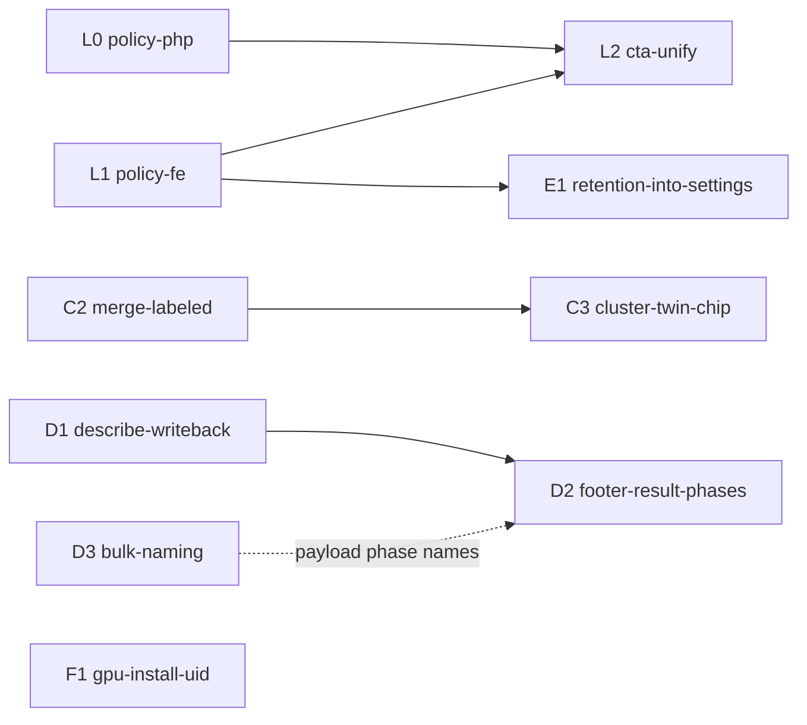

# WBUX-6. Workbench Describe-first Wave

> **Task:** `WBUX-6` · branch `feature/wbux-6` · worktree `context-alt-text-monorepo-wbux-6` · base `08379faf`
> **Date:** 2026-09-02
> **Grounding (read, do not duplicate):**
> - UX-map SSOT: `apps/prototype-wp-alt-context/docs/ux-maps/workbench-2pane.uxmap.json` (zone `z-lib-actions`, actions `act-bulk-describe`, `act-scan-media-queue`, `act-run-recognition`; OPEN critique item "Bulk-describe cost preview granularity [INT-07]").
> - Prior art (FTS, semantic provider degraded at planning time): E21-12 (retention page placement, rejected a *footer* link only), UXP-2/UXP-3 (footer single-primary + roster suggestion projection), GPUW-1 (burst-GPU describe lifecycle @08379faf), WBUX-5 (two-pane redesign, commit-before-reveal naming).
> - Heuristic ids `[XXX-nn]` are stable citations from `~/Development/heuristics-canon-research/lexicons/{interaction-ux,engineering,graph-theory}.md`, verified present 2026-09-02. Distilled corpus checks cite chapter names (`distilled/engineering/{release-it,designing-data-intensive-applications,latency-*}.md` carry no inline ids).

## Goal

Make the Workbench footer a **single describe-first job entry**: one CTA ("Describe N selected") that, under a **global recognition policy setting**, chains identity analysis before description; bulk-describe results land back in the workbench rows; a duplicate unlabeled cluster of an already-named person is offered as a merge suggestion instead of a silent twin; Data Retention leaves the top-level menu and becomes a Settings section; the GPU burst installer stops creating an unwritable `/run/acx`.

## Operator questions answered

**a. Unified CTA + where the "describe only" choice lives → GLOBAL setting, per-run disclosure, not per-image.**
`[NAV-06]` frequency elevates chrome: describing is the per-visit job, "do we identify people at all" is a rare data-protection policy → chrome keeps one CTA, the policy sits behind Settings. `[COG-03]`/`[INT-06]` one goal-scented action label ("Describe 12 selected"), not two verbs the user must distinguish. `[HAI-04]` activate–operate–override: the setting activates recognition, the CTA operates, per-media exclusions (`_acx_alt_decorative`, existing) remain the override. `[HAI-05]` the footer discloses when AI identification runs and links to where it is turned off. A per-image toggle would scatter a policy across thousands of rows, break `[HAI-06]` auditability ("was recognition on for this run?") and double every footer state `[RLSE-04]`. Default: **ON** for this recognition-plugin install (operator installs it knowingly), disclosed inline; departure from `[FORM-04]` (sensitive opt-in as default) is recorded as an explicit decision for operator review — flip to OFF-by-default is a one-line change in `RecognitionPolicy::DEFAULT`.

**b. Duplicate cluster (labeled + unlabeled twin) → merge-suggestion eligibility bug.** `merge_suggestions._is_eligible_for_merge_suggestion` returns False for any `user_confirmed` labeled cluster, so a labeled↔unlabeled pair is never proposed; discovery assigns a face to a new cluster whenever the best similarity falls in `[suggestion_floor, similarity_threshold)`, exactly the band suggestions were built for. Fix: allow pairs where **exactly one** side is labeled; labeled side is the survivor `[HAI-11]`/`[HAI-15]` human confirms, `[HAI-02]` the confirmation reaches the cluster store. Never auto-merge.

**c. "Description still not wired" → three gaps.** G3 seeded adapter on dev (fixed by the 08379faf redeploy, prod still 73264a12); G1 apply success invalidates only run-item queries, workbench rows never refetch; G2 footer terminal state has no result surface. D1/D2 close G1/G2.

**d. Retention as a top-level menu → fold into Settings.** `[NAV-05]` MECE: Settings already means "configure the service"; retention is configuration with a destructive edge, not a daily surface `[NAV-06]`. E21-12 rejected a *footer* link to retention, not Settings placement. Menu goes 6 → 5 entries; old slug redirects `[NAV-14]` (no dead bookmarks).

## Verified code reality

- Footer `MediaSelection.tsx:151-188` renders `<BulkDescribeCta>` + `<MediaAnalyzeCta>`; accent owner from `mediaFooterCtaState.ts` (`ANALYZE` default primary, `DESCRIBE` while running, `CARD` in review). DOM single-primary invariant in `mediaFooterSinglePrimary.dom.test.tsx`.
- `MediaAnalyzeCta.tsx` calls `useJobPipeline().scan(mediaIds)`; scan → `POST /acx/v1/recognition/analyze` (`class-analysis-jobs-controller.php:120+`, `can_manage_recognition`).
- Settings: `settingsApi.ts` `SettingsResponse`/`SaveSettingsPayload`; `class-settings-controller.php` validate → `update_option` → `option_matches_intended` → `saved[]/failed[]` pattern; `SettingsForm.tsx` + `SettingsPage.test.tsx`.
- Menu: `class-menu.php:15-22` `SUBMENU_IA`; `App.tsx:52-59` `/retention` route; parity tests `MenuTest.php`, `App.test.tsx`, `menuHeadingParity.test.ts`.
- Apply hook `useDescribeRunApply.ts:39-92` invalidates `describeRunItemsQueryKey(runId)` + media stats only; workbench key is `queryKeys.media.workbench()` (`queryKeys.ts:20`).
- Naming fusion: single-image path `scene/interface_adapters/http/routers/describe.py:293 _naming_preview` (gated by `tenant.naming_agreement_enabled`); bulk path `scene/application/describe_run_worker.py` does not call it.
- Installer `scripts/deploy/gpu-lifecycle-install.sh:163-171` creates `/run/acx` as `10001:10001 0775` so the api container (uid 10001, gid 999) can write `describe-load.json`.

## Screens (ASCII, iteration targets for `workbench-2pane.uxmap.json` zone `z-lib-actions`)

Footer today (two competing primaries by scope, `[INT-03]` violated):

```
┌ .acx-media-selection__footer ───────────────────────────────────────────────┐
│ ‹ 1 2 3 ›   [ Describe selected ]   Ready to analyze 12 media items.        │
│                                     [ Analyze selected media ]  (primary)   │
└──────────────────────────────────────────────────────────────────────────────┘
```

Footer proposed — idle, recognition ON (`[INT-06]` count in label, `[HAI-05]` disclosure + off-ramp):

```
┌ footer ──────────────────────────────────────────────────────────────────────┐
│ ‹ 1 2 3 ›   [ Describe 12 selected ]  (primary)                              │
│             Identifies people first (AI) · ~12 credits · Turn off in Settings│
└──────────────────────────────────────────────────────────────────────────────┘
```

Idle, recognition OFF (same button, disclosure line changes; no second button):

```
│ ‹ 1 2 3 ›   [ Describe 12 selected ]  (primary)                              │
│             People are not identified (recognition off) · ~12 credits        │
```

Running — phases `queued → identifying → warming (GPU) → describing → done` (`[INT-08]` wait state + cancel, `[INT-10]` status–predict–stop, `[HAI-18]` name the deferred effect):

```
│ ‹ 1 2 3 ›   Identifying people… 3/12  ▓▓▓░░░░░░░   [ Cancel ]                │
│ ‹ 1 2 3 ›   Warming GPU (about 2 min, first run only)… [ Cancel ]            │
│ ‹ 1 2 3 ›   Describing… 7/12  ▓▓▓▓▓▓░░░░   [ Cancel ]                        │
```

Done (`[INT-05]` prominent Done, result named; rows refetched so drafts are visible):

```
│ ‹ 1 2 3 ›   ✔ 12 described · 2 need review   [ Review drafts ]  [ Dismiss ]  │
```

Settings › new section (`[FORM-04]` explicit choice, `[HAI-05]` how to disable):

```
┌ Settings ────────────────────────────────────────────────────────────────────┐
│ Service connection …                                                          │
│ Alt text style …                                                              │
│ ── People & recognition ─────────────────────────────────────────────────────│
│ [x] Identify people in photos                                                 │
│     Uses facial recognition to name people in descriptions. When off,        │
│     Describe writes alt text without identities. Applies to every run.        │
│ ── Data & retention  (moved from the Data Retention menu) ───────────────────│
│ Purge tenant data · Audit timeline …  (existing RetentionPage content)        │
└──────────────────────────────────────────────────────────────────────────────┘
```

Cluster row with a suggested twin (`[HAI-11]` propose, never auto-apply):

```
┌ .acx-identity-clusters ──────────────────────────────────────────────────────┐
│ ● Ada Lovelace (7)   ○ cluster-9f2 (3)  ⇢ Same person as Ada Lovelace?        │
│                                          [ Merge into Ada ] [ Not the same ] │
└──────────────────────────────────────────────────────────────────────────────┘
```

Menu IA before → after (`[NAV-05]`, `[NAV-06]`):

```
Overview · Review Queue · People · Description Runs · Data Retention · Settings
Overview · Review Queue · People · Description Runs · Settings (People & recognition, Data & retention)
```

## Canon validation

| Rule | Where it bites | Applied how |
| --- | --- | --- |
| `[INT-03]` button group by scope | two footer primaries with different scopes | one CTA; recognition is a policy, not a sibling button |
| `[INT-06]`/`[COG-03]` | "Describe selected" vs "Analyze selected media" | "Describe N selected"; pipeline steps become progress phases |
| `[INT-07]` preview before commit | OPEN uxmap item | disclosure line carries credit estimate + recognition state |
| `[INT-08]`/`[INT-10]`/`[HAI-18]` | GPU cold start hides ~2 min | explicit `warming` phase with predicted duration, cancel stays live |
| `[HAI-04]`/`[HAI-05]` | AI identification runs silently | activate (setting) / operate (CTA) / override (per-media flag); disclosure + off-ramp |
| `[HAI-11]`/`[HAI-15]`/`[HAI-02]` | duplicate cluster | suggestion → human confirm → merge reaches store |
| `[FORM-04]` | default of a sensitive toggle | default ON recorded as a reviewable decision; not silent |
| `[NAV-05]`/`[NAV-06]`/`[NAV-14]` | retention as top-level | Settings section + slug redirect |
| `[RLSE-04]` undesigned state is a bug | footer states | idle-on / idle-off / offline / running×4 / done / error each drawn above |
| `[DATA-14]` no dual writes | recognition policy | WP option is the only store; backend reads the flag on the request, no tenant mirror |
| `[RES-13]` bugs are survived | recognition disabled but a stale client calls analyze | server-side fail-closed `409 recognition_disabled`, FE shows the error state |
| `[RES-03]` slow failure worse than fast | analyze→describe chain | chain aborts on first phase error, no blind continue |
| `[PERF-10]` join independent waits | describe worker naming fusion | face lookup and VLM prompt build are independent; await together |
| `[TEST-15]` prove green can go red | every lane | RED gate recorded via `make slice-start` before edits |
| `[GRPH-01]`/`[GRPH-31]`/`[GRPH-32]`/`[GRPH-33]` | wave scheduling | DAG below: edges only where data moves, contracts fixed up front |

Distilled corpus checks. *Release It!* (Stability patterns: Fail Fast, Timeouts, Steady State): the policy gate fails fast server-side; the chained describe inherits the existing run timeouts; `/run/acx` snapshot is the steady-state signal the GPU reaper depends on, so the installer fix is a stability fix, not cosmetics. *DDIA* (ch. 5 replication / ch. 12 derived data): the recognition flag has one writer (WP option) and derived readers; no second store. *Latency* (asynchrony hides latency, it does not remove it): the `warming` phase makes the hidden GPU boot visible instead of pretending the request is fast.

## DAG (`[GRPH-01]` toposort, `[GRPH-32]` edge only where data moves)



| Edge | Data that moves | Contract fixed at planning (`[GRPH-33]`) |
| --- | --- | --- |
| L0→L2, L1→L2 | `recognition_enabled: boolean` on `GET/POST /acx/v1/settings` | field name, type, 400 code `invalid_recognition_enabled`, 409 `recognition_disabled` on analyze |
| L1→E1 | `SettingsForm.tsx` section layout | E1 appends a section, never edits L1's |
| C2→C3 | merge suggestion carries `survivor_cluster_id` + `survivor_label` | existing suggestion payload gains the labeled survivor |
| D1→D2 | workbench refetch on terminal run | D2 renders result counts from the run summary |
| D3⇢D2 | `DescribeRunPhase` gains `warming` | enum value string `warming` |

Wave 1 (width 6, no inter-lane edges): L0, L1, C2, D1, D3, F1. Wave 2: L2, E1, C3, D2. **Critical path** (`[GRPH-31]`): L1 → L2 (settings query → footer). Everything else is slack.

## Lanes

Every lane: branch `lane/wbux-6-<slug>` from `feature/wbux-6`, worktree `context-alt-text-monorepo-wbux-6-<slug>`, grok-remote grok-4.6 high, commit by turn 8, one behavior path, RED test first. Lane `test_cmd` is the gate the pass reports.

| Lane | Slug | Files | RED test | Done when |
| --- | --- | --- | --- | --- |
| L0 | `policy-php` | new `src/settings/class-recognition-policy.php` (`AltContext\Settings\RecognitionPolicy`, option `acx_recognition_enabled`, `DEFAULT=true`, `enabled(): bool`), `class-settings-controller.php` GET+POST `recognition_enabled`, `class-analysis-jobs-controller.php` 409 gate | `tests/Unit/Settings/RecognitionPolicyTest.php`, additions to `SettingsControllerTest.php`, `AnalysisJobsControllerTest.php` | `vendor/bin/phpunit --testsuite Unit` green; `require_once` wired per rg-016 |
| L1 | `policy-fe` | `settingsApi.ts` (`recognition_enabled` on response + payload), `SettingsForm.tsx` "People & recognition" checkbox section, `useSettingsPageState.ts` | `SettingsPage.test.tsx` toggle renders from GET and posts on save | `npx vitest run js/admin/pages/settings` green; msw fixtures updated |
| C2 | `merge-labeled` | `recognition/application/suggestions/merge_suggestions.py` eligibility + pair generation | new `recognition/tests/unit/test_merge_suggestions_labeled_pairs.py`: labeled↔unlabeled in band ⇒ suggested with labeled survivor; labeled↔labeled ⇒ never; below floor ⇒ never | `uv run --extra dev pytest recognition/tests/unit -k merge_suggestion` green |
| D1 | `describe-writeback` | `useDescribeRunApply.ts`, `useBulkDescribe.ts` (terminal transition) | `useDescribeRunApply.test.tsx`: apply success invalidates `queryKeys.media.workbench()`; `useBulkDescribe.test.tsx`: terminal run invalidates workbench | `npx vitest run js/admin/hooks` green |
| D3 | `bulk-naming` | `scene/application/describe_run_worker.py` calls the naming-preview service extracted from `routers/describe.py:293` when `tenant.naming_agreement_enabled` | new `scene/tests/.../test_describe_run_worker_naming.py`: run item prompt contains fused names when enabled, none when disabled | `uv run --extra dev pytest scene -k naming` green; router still uses the extracted service |
| F1 | `gpu-install-uid` | `scripts/deploy/gpu-lifecycle-install.sh:163-171` owner `10001:10001` | `apps/prototype-description-service/tests/test_gpu_lifecycle_install_script.py` asserts both lines | pytest green |
| L2 | `cta-unify` | `MediaSelection.tsx`, `BulkDescribeCta.tsx`, remove `MediaAnalyzeCta.tsx`, `mediaFooterCtaState.ts` (drop `ANALYZE` owner), `useJobPipeline` chain analyze→describe when enabled, uxmap SSOT + `.md` re-render | `mediaFooterSinglePrimary.dom.test.tsx` + new `BulkDescribeCta.disclosure.test.tsx` | vitest green; ux-map critique zero high |
| E1 | `retention-into-settings` | `class-menu.php` SUBMENU_IA, `App.tsx` route → redirect, `SettingsPage` gains "Data & retention" section hosting `RetentionPage` content | `MenuTest.php`, `App.test.tsx`, `menuHeadingParity.test.ts` updated first | php + vitest green |
| C3 | `cluster-twin-chip` | `IdentityClusterItem.tsx` / `MergeSuggestionCard.tsx` render labeled-survivor suggestion inline | component test | vitest green |
| D2 | `footer-result-phases` | `BulkDescribeCta.tsx` done state, `DescribeRunPhase` `warming` (FE + `scene/domain/describe_run.py`) | phase copy tests | vitest + pytest green |

## Review gate

After each wave: `/wb-review-slice` with one local Claude lens + remote grok-4.6 reviewers (canon lexicons + distilled corpus rsynced), findings via `review_findings batch_record`, trial-merge the combined wave tree before merging any lane, `handoff_close_check(enforce=True)` before `feature/wbux-6` → `main`.

## Checklist

- [ ] Wave 1 lanes dispatched (`dispatch_wave` under `WBUX-6`) and committed on their `lane/wbux-6-*` branches
- [ ] Wave 1 reviewed (`review_runs` recorded) and trial-merged into `feature/wbux-6`
- [ ] Wave 2 lanes dispatched after L1/C2/D1 land
- [ ] `workbench-2pane.uxmap.json` updated for the unified footer, critique zero high (`ux-map critique`)
- [ ] Decision recorded for recognition default ON (operator-reviewable)
- [ ] Prod redeploy to 08379faf+ and `/run/acx` chown applied on the VM (operator-held, `scripts/deploy/gpu-lifecycle-install.sh` re-run)
- [ ] `handoff_close_check(enforce=True)` pass, merge to `main`, `make task-finish TASK=WBUX-6`
