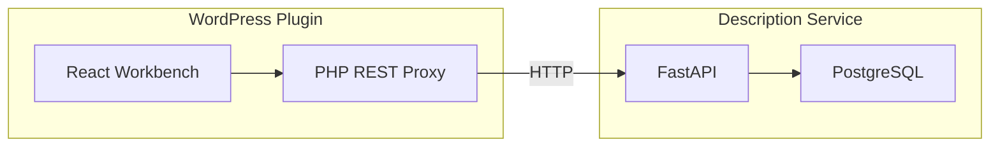
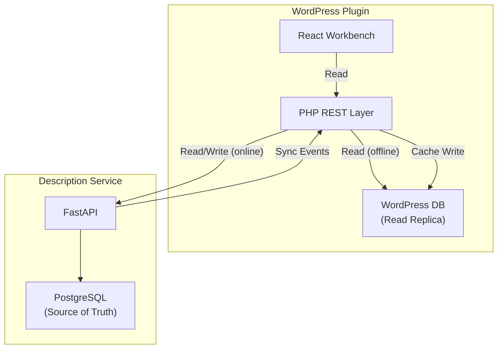
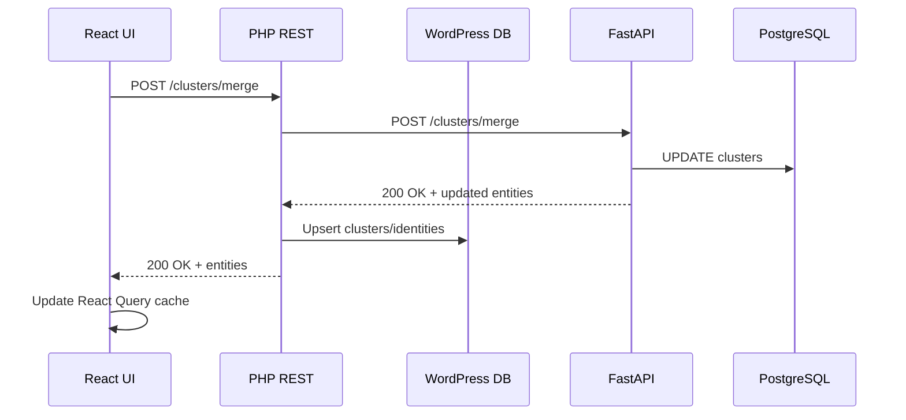

# Offline Cluster Persistence Architecture

**Created**: 2026-01-25  
**Status**: PROPOSAL  
**Context**: Workbench requires live connection to Description Service to display clusters — users cannot view or manage identities when the backend is unavailable.

---

## 1. Problem Statement

### Current Architecture



**Issue**: All cluster/identity data lives exclusively in the Description Service's PostgreSQL database. When the service is:

- **Down**: Workbench shows "Unable to connect" — no cluster data visible
- **Slow**: UI blocks waiting for API responses
- **Unreachable**: Remote deployments (e.g., staging WP → local dev backend) fail entirely

### User Impact

1. **No offline viewing** — Cannot review clusters when backend is unavailable
2. **No cached state** — Every page load requires fresh API call
3. **Fragile UX** — Single point of failure for the entire identity management UI
4. **Dev friction** — Frontend developers need running backend to work on UI

---

## 2. Proposed Solution

### Dual-Write Architecture with WordPress as Read Replica



**Key Principles**:

1. **PostgreSQL remains source of truth** — All clustering logic, embeddings, and assignments stay in the backend
2. **WordPress DB is a read cache** — Stores denormalized cluster/identity data for display
3. **Sync on mutation** — Backend pushes updates to WordPress after each operation
4. **Graceful degradation** — UI works with stale data when backend is unavailable

---

## 3. Data Model

### 3.1 What to Sync

| Entity          | Source (PG)           | Cached in WP | Notes                                    |
| --------------- | --------------------- | ------------ | ---------------------------------------- |
| **Clusters**    | `clusters` table      | ✅ Yes       | Label, member count, representative face |
| **Identities**  | `identities` table    | ✅ Yes       | Thumbnail URL, cluster assignment        |
| **Suggestions** | `suggestions` table   | ✅ Yes       | Pending review items                     |
| **Embeddings**  | `identity_embeddings` | ❌ No        | Too large, only needed for clustering    |
| **Job History** | `scan_jobs`           | ⚠️ Partial   | Last N jobs for status display           |

### 3.2 WordPress Database Schema

```sql
-- Custom table: acx_clusters
CREATE TABLE {$wpdb->prefix}acx_clusters (
    id VARCHAR(36) PRIMARY KEY,           -- UUID from backend
    tenant_id BIGINT NOT NULL,            -- WP site/blog ID
    label VARCHAR(255),                   -- User-assigned name
    member_count INT DEFAULT 0,
    representative_identity_id VARCHAR(36),
    representative_thumbnail_url TEXT,
    user_confirmed TINYINT(1) DEFAULT 0,
    created_at DATETIME,
    updated_at DATETIME,
    synced_at DATETIME,                   -- Last sync timestamp
    INDEX idx_tenant (tenant_id),
    INDEX idx_label (tenant_id, label)
) ENGINE=InnoDB DEFAULT CHARSET=utf8mb4;

-- Custom table: acx_identities
CREATE TABLE {$wpdb->prefix}acx_identities (
    id VARCHAR(36) PRIMARY KEY,           -- UUID from backend
    tenant_id BIGINT NOT NULL,
    cluster_id VARCHAR(36),               -- FK to acx_clusters
    media_id BIGINT,                      -- WP attachment ID
    thumbnail_url TEXT,                   -- Face crop URL
    bounding_box JSON,                    -- {x, y, width, height}
    confidence FLOAT,
    created_at DATETIME,
    synced_at DATETIME,
    INDEX idx_tenant (tenant_id),
    INDEX idx_cluster (cluster_id),
    INDEX idx_media (media_id)
) ENGINE=InnoDB DEFAULT CHARSET=utf8mb4;

-- Custom table: acx_suggestions
CREATE TABLE {$wpdb->prefix}acx_suggestions (
    id VARCHAR(36) PRIMARY KEY,
    tenant_id BIGINT NOT NULL,
    identity_id VARCHAR(36) NOT NULL,
    target_cluster_id VARCHAR(36) NOT NULL,
    similarity FLOAT,
    status ENUM('pending', 'accepted', 'rejected') DEFAULT 'pending',
    created_at DATETIME,
    synced_at DATETIME,
    INDEX idx_tenant_status (tenant_id, status)
) ENGINE=InnoDB DEFAULT CHARSET=utf8mb4;

-- Custom table: acx_sync_state
CREATE TABLE {$wpdb->prefix}acx_sync_state (
    id INT AUTO_INCREMENT PRIMARY KEY,
    tenant_id BIGINT NOT NULL,
    last_sync_cursor VARCHAR(255),        -- Pagination cursor for incremental sync
    last_sync_at DATETIME,
    sync_status ENUM('idle', 'syncing', 'error') DEFAULT 'idle',
    error_message TEXT,
    UNIQUE KEY idx_tenant (tenant_id)
) ENGINE=InnoDB DEFAULT CHARSET=utf8mb4;
```

### 3.3 PHP Repository Classes

```php
namespace AltContext\Recognition\Repository;

class ClusterRepository {
    public function findAll(int $tenantId): array;
    public function findById(string $id): ?Cluster;
    public function upsert(Cluster $cluster): void;
    public function delete(string $id): void;
    public function getLastSyncTime(int $tenantId): ?DateTimeImmutable;
}

class IdentityRepository {
    public function findByCluster(string $clusterId): array;
    public function findByMedia(int $mediaId): array;
    public function upsert(Identity $identity): void;
}

class SuggestionRepository {
    public function findPending(int $tenantId, int $limit = 50): array;
    public function upsert(Suggestion $suggestion): void;
    public function markResolved(string $id, string $status): void;
}
```

---

## 4. Sync Mechanism

### 4.1 Sync Triggers

| Trigger             | Direction         | Mechanism                                   |
| ------------------- | ----------------- | ------------------------------------------- |
| **Scan complete**   | Backend → WP      | SSE event with cluster summary              |
| **User action**     | WP → Backend → WP | Mutation response includes updated entities |
| **Manual refresh**  | WP → Backend      | Explicit sync button in Workbench           |
| **Background cron** | WP → Backend      | Hourly incremental sync (optional)          |

### 4.2 SSE Event Extensions

Current SSE events for scan jobs:

```json
{"type": "progress", "images_processed": 45, "total": 100}
{"type": "complete", "job_id": "abc123"}
```

**Proposed additions**:

```json
{
  "type": "sync_payload",
  "clusters": [
    {
      "id": "cluster-uuid",
      "label": "Daniel",
      "member_count": 15,
      "representative_thumbnail_url": "/wp-content/uploads/faces/abc123.jpg",
      "user_confirmed": true
    }
  ],
  "identities": [
    {
      "id": "identity-uuid",
      "cluster_id": "cluster-uuid",
      "media_id": 456,
      "thumbnail_url": "/wp-content/uploads/faces/def456.jpg"
    }
  ],
  "suggestions": [
    {
      "id": "suggestion-uuid",
      "identity_id": "identity-uuid-2",
      "target_cluster_id": "cluster-uuid",
      "similarity": 0.78
    }
  ]
}
```

### 4.3 Incremental Sync Protocol

```
GET /acx/v1/recognition/sync?since={cursor}

Response:
{
  "clusters": [...],
  "identities": [...],
  "suggestions": [...],
  "deleted": {
    "clusters": ["uuid1", "uuid2"],
    "identities": ["uuid3"]
  },
  "next_cursor": "2026-01-25T10:30:00Z",
  "has_more": false
}
```

**Backend endpoint** (new):

```python
@router.get("/sync")
async def get_sync_payload(
    since: datetime | None = None,
    limit: int = 100,
    tenant_id: str = Depends(get_tenant_id),
) -> SyncResponse:
    """Return entities modified since cursor for incremental sync."""
    ...
```

---

## 5. Read Path (Offline-First)

### 5.1 PHP REST Endpoints

```php
// GET /wp-json/acx/v1/clusters
public function get_clusters(WP_REST_Request $request): WP_REST_Response {
    $tenant_id = get_current_blog_id();

    // Try backend first if online
    if ($this->is_backend_available()) {
        try {
            $response = $this->backend_client->get('/clusters');
            $this->sync_to_local($response);
            return new WP_REST_Response($response, 200);
        } catch (ConnectionException $e) {
            // Fall through to local cache
        }
    }

    // Offline fallback: read from WordPress DB
    $clusters = $this->cluster_repo->findAll($tenant_id);
    $last_sync = $this->cluster_repo->getLastSyncTime($tenant_id);

    return new WP_REST_Response([
        'clusters' => $clusters,
        'offline' => true,
        'last_synced_at' => $last_sync?->format('c'),
    ], 200);
}
```

### 5.2 Frontend Handling

```tsx
interface ClustersResponse {
  clusters: Cluster[];
  offline?: boolean;
  last_synced_at?: string;
}

function useClusters() {
  const query = useQuery({
    queryKey: ["clusters"],
    queryFn: fetchClusters,
    staleTime: 60_000,
  });

  const isOffline = query.data?.offline ?? false;
  const lastSyncedAt = query.data?.last_synced_at;

  return {
    ...query,
    isOffline,
    lastSyncedAt,
  };
}

// UI indicator
{
  isOffline && (
    <Banner variant="warning">
      {__("Showing cached data from", "alt-context")} {formatDate(lastSyncedAt)}
    </Banner>
  );
}
```

---

## 6. Write Path (Online Required)

### 6.1 Mutation Flow



### 6.2 Optimistic Updates with Rollback

```tsx
const mergeClusters = useMutation({
  mutationFn: (params) => api.post("/clusters/merge", params),
  onMutate: async (params) => {
    // Cancel outgoing queries
    await queryClient.cancelQueries(["clusters"]);

    // Snapshot for rollback
    const previous = queryClient.getQueryData(["clusters"]);

    // Optimistic update
    queryClient.setQueryData(["clusters"], (old) =>
      mergeClustersOptimistic(old, params),
    );

    return { previous };
  },
  onError: (err, params, context) => {
    // Rollback on error
    queryClient.setQueryData(["clusters"], context.previous);
    toast.error(__("Merge failed. Changes reverted.", "alt-context"));
  },
  onSettled: () => {
    // Refetch to ensure consistency
    queryClient.invalidateQueries(["clusters"]);
  },
});
```

### 6.3 Offline Queue (Future Enhancement)

For true offline-first with write support:

```php
// Queue mutations when offline
CREATE TABLE {$wpdb->prefix}acx_mutation_queue (
    id INT AUTO_INCREMENT PRIMARY KEY,
    tenant_id BIGINT NOT NULL,
    action VARCHAR(50) NOT NULL,        -- 'merge', 'rename', 'assign', etc.
    payload JSON NOT NULL,
    status ENUM('pending', 'synced', 'failed') DEFAULT 'pending',
    created_at DATETIME,
    synced_at DATETIME,
    error_message TEXT
);
```

This enables users to make changes offline that sync when connectivity returns. **Out of scope for initial implementation.**

---

## 7. Implementation Plan

### Phase 1: Database & Repository (4 hrs)

- [ ] Create migration for `acx_clusters`, `acx_identities`, `acx_suggestions`, `acx_sync_state` tables
- [ ] Implement `ClusterRepository`, `IdentityRepository`, `SuggestionRepository` PHP classes
- [ ] Add unit tests for repository CRUD operations
- [ ] Add activation hook to create tables

### Phase 2: Sync Mechanism (6 hrs)

- [ ] Add `/sync` endpoint to FastAPI backend
- [ ] Extend SSE events with `sync_payload` type
- [ ] Implement `SyncService` PHP class to process sync payloads
- [ ] Add sync state tracking (cursor, last sync time)
- [ ] Handle deleted entities (soft delete or remove from WP)

### Phase 3: Read Path Integration (4 hrs)

- [ ] Modify PHP REST endpoints to check backend availability
- [ ] Implement fallback to local repository when offline
- [ ] Add `offline` and `last_synced_at` to API responses
- [ ] Update React Query hooks to handle offline state
- [ ] Add UI banner for offline mode

### Phase 4: Write Path Integration (4 hrs)

- [ ] Ensure all mutations sync results to WordPress DB
- [ ] Implement optimistic updates with rollback
- [ ] Add error handling for sync failures
- [ ] Test mutation → sync → cache invalidation flow

### Phase 5: Testing & Polish (4 hrs)

- [ ] Integration tests: online/offline transitions
- [ ] Test with slow/unreliable backend connections
- [ ] Add "Sync Now" button to Workbench
- [ ] Add sync status indicator to UI
- [ ] Document offline capabilities

---

## 8. Trade-offs & Decisions

### 8.1 Why Not Full Offline-First?

| Approach                    | Pros                           | Cons                              |
| --------------------------- | ------------------------------ | --------------------------------- |
| **Read replica (proposed)** | Simple, no conflict resolution | Writes require backend            |
| **Full offline-first**      | Works without backend          | Complex sync, conflict resolution |
| **Local-first (CRDTs)**     | Seamless merge                 | Significant complexity, overkill  |

**Decision**: Read replica is sufficient for v1. Users can view/browse offline but need connectivity for mutations. This matches user expectations and avoids sync complexity.

### 8.2 Why Custom Tables vs Post Meta?

| Storage           | Pros                                       | Cons                                  |
| ----------------- | ------------------------------------------ | ------------------------------------- |
| **Custom tables** | Fast queries, proper indexes, foreign keys | Custom SQL, more code                 |
| **Post meta**     | WP-native, search integration              | Slow for large datasets, no relations |
| **Options API**   | Simple                                     | Not designed for structured data      |

**Decision**: Custom tables. Identity/cluster data is relational (cluster → identities) and will grow to thousands of rows. Post meta would be painfully slow.

### 8.3 Sync Frequency

| Strategy                  | Latency        | Complexity | Resource Usage |
| ------------------------- | -------------- | ---------- | -------------- |
| **Real-time (WebSocket)** | <1s            | High       | High           |
| **SSE on mutation**       | <5s            | Medium     | Medium         |
| **Polling (30s)**         | 30s            | Low        | High           |
| **Manual refresh**        | User-triggered | Low        | Low            |

**Decision**: SSE on mutation (primary) + manual refresh button. No polling to avoid unnecessary load.

---

## 9. Security Considerations

### 9.1 Tenant Isolation

- All WordPress tables include `tenant_id` column
- All queries filter by `get_current_blog_id()`
- Backend sync payloads scoped to requesting tenant's API key

### 9.2 Data Sensitivity

- Thumbnail URLs point to WordPress uploads (already access-controlled)
- No embeddings stored in WordPress (too sensitive, too large)
- Cluster labels may contain PII (names) — follow existing WP data handling

### 9.3 Sync Authentication

- Sync requests use same API key mechanism as other backend calls
- SSE events authenticated via existing session
- No new attack surface introduced

---

## 10. Success Metrics

| Metric                   | Target                       | Measurement                                      |
| ------------------------ | ---------------------------- | ------------------------------------------------ |
| **Offline availability** | 100% read access when cached | Manual test: disconnect backend, verify UI loads |
| **Sync latency**         | <5s after mutation           | Log timestamps on SSE receipt                    |
| **Cache hit rate**       | >90% for repeat views        | PHP logging on cache vs API calls                |
| **No data loss**         | 0 dropped sync events        | Compare WP vs PG row counts                      |

---

## 11. References

- [Current backend architecture](../../../docs/agentic/maps/backend.md)
- [Frontend state management](../../../docs/agentic/maps/frontend.md)
- [API contracts](../../../docs/agentic/contracts/clustering-api.md)
- [WordPress custom tables guide](https://developer.wordpress.org/plugins/custom-tables/)
